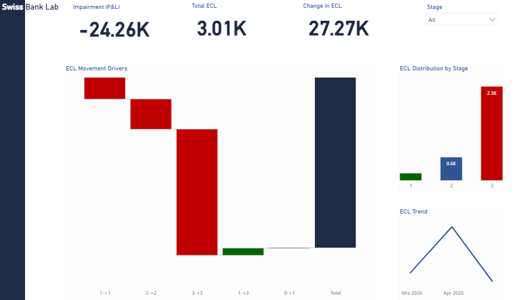

# IFRS9 Swiss Bank Lab

## Overview
End-to-end banking data platform simulating IFRS9 Expected Credit Loss (ECL) calculation and impairment reporting.

The project integrates risk and finance data to produce:
- ECL calculation at exposure level
- Stage classification (Stage 1, 2, 3)
- Impairment reporting (P&L impact)
- Dashboard-ready datasets

## Business Context
Under IFRS9, banks must estimate credit losses using forward-looking models.

This project reproduces a simplified but realistic workflow:
- Exposure snapshots by reporting date
- Credit risk staging
- Probability of Default (PD) and Loss Given Default (LGD)
- Expected Credit Loss (ECL = PD × LGD × Exposure)
- Period-over-period impairment movement

## Architecture

Data Flow:
1. Source data → exposure snapshots  
2. Risk layer → staging + ECL calculation  
3. Finance layer → impairment aggregation  
4. Reporting layer → dashboard dataset  

## Tech Stack
- PostgreSQL (data platform)
- SQL (data modeling & IFRS9 logic)
- Python (data extraction & automation)
- Power BI (dashboard reporting)

## Project Structure
- `sql/01_ddl` → schema and table creation  
- `sql/02_seed` → data loading  
- `sql/03_risk_calculation` → IFRS9 ECL logic  
- `sql/04_finance_reporting` → impairment reporting  
- `sql/05_controls` → reconciliation checks  
- `python/` → automation scripts  
- `power_bi/` → dashboard and screenshots  
- `reports/` → output datasets  

## Dashboard

### IFRS9 ECL & Impairment Overview

## Key Features
- Snapshot-based IFRS9 architecture  
- Exposure-level ECL calculation  
- Stage migration tracking  
- Risk-to-finance bridge  
- Impairment (P&L) calculation  
- Reconciliation controls  

## Skills Demonstrated
- Financial reporting and IFRS9 logic  
- Banking data modeling  
- SQL development  
- Python data processing  
- Data validation and controls  
- Dashboard design for finance  

## Recruiter Perspective
This project demonstrates the ability to:
- Translate regulatory requirements into data models  
- Connect risk metrics with financial reporting  
- Build structured, auditable data pipelines  
- Deliver business-oriented analytics  

## Author
Giandomenico Curcio  
Finance | IFRS9 | Data Analytics
